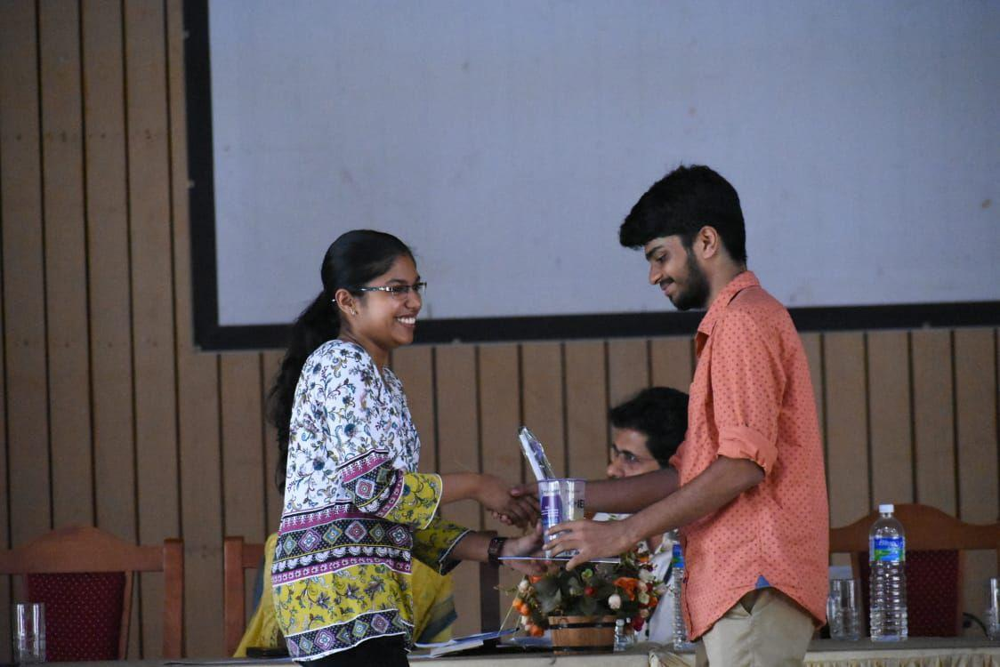

HRIDHIKA 4.0  is the annual general body meeting of IEEE SB GCEK for selecting new executive committee members for the year 2020-21 and to welcome it’s new members. 87 people attended the meeting.  It was held on February  1st 2020 at the Main Auditorium, Govt. College of Engineering, Kannur.
The inaugural function commenced with the IEEE Code of Ethics which was read out by Mr Pratheek Nambiar. Mr Abhinav S Praveen welcomed the gathering. The presidential address was given by Dr.Manoj Kumar M V, SB counsellor.

The event was inaugurated by Dr.V O Rejini, Principal, GCEK.  Ms Pooja Haridas presented the Annual Report. Announcement of new Execom was done by Prof.Manojkumar, SB Counsellor. Certificates were given out to the Best Volunteer, Best Office Bearer and Best Wie Volunteer. Ms Anagha N delivered the vote of thanks.
The inaugural function and the event came to an end by 11 30 am after which food and refreshments were provided.
