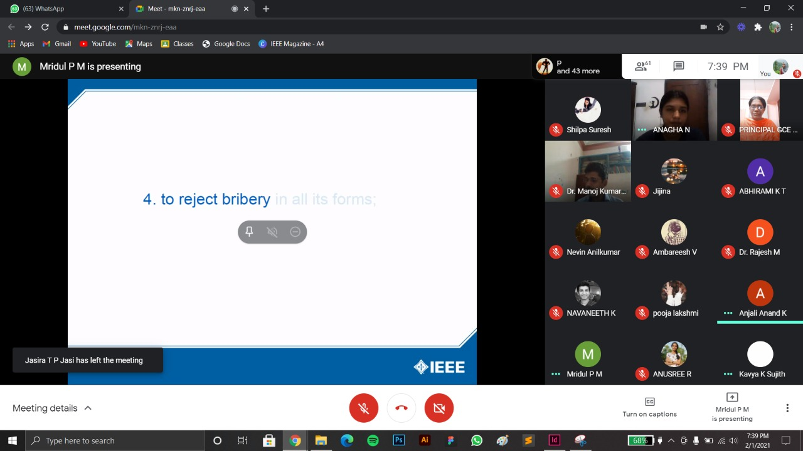

The 5th Annual General Meeting of IEEE SB GCEK, Hridhika 5.0, was conducted on 1st February 2021 at 07:30 PM in Google Meet.
It commenced with the welcome speech by Ms. Anagha N. Mr. Mridul P M then pledged the Code of Ethics.
The function was inaugurated by Dr. V O Rejini, Principal of GCEK. 
The branch counsellor Dr. Manoj Kumar announced the new Execom as well as the SB Volunteer Award winners. Awards were given for the best office bearer, best volunteer and best WIE volunteer. 
An annual report of the activities of SB for year 2020-21 was presented by 
Mr. Pratheek Nambiar. 
The function was presided over by Dr. Jayaprakash, Dr. M Rajesh and Mrs. Anjali Anand, the chapter advisors of IAS, PELS and WIE affinity group respectively.
The event concluded with a vote of thanks by Ms. Haritha M E. 
71 students joined us in the event.

