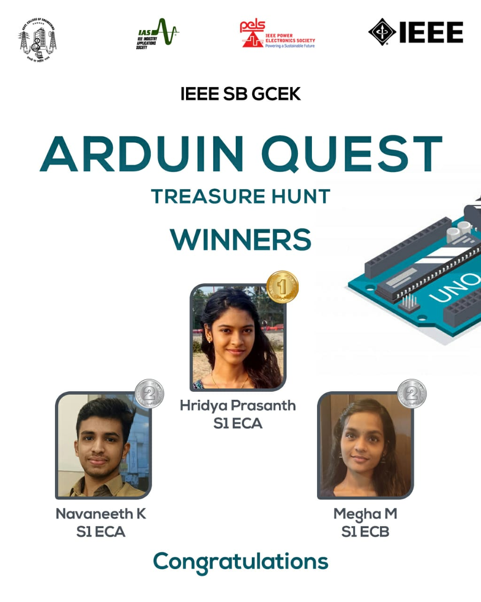

IAS chapter of IEEE SB GCEK in collaboration with PELS chapter came up with a very interesting event as a part of Arduino Day which was a virtual treasure hunt. The event was named as ‘Arduin Quest’ following the name of the bar which was named after Arduin of Ivrea, King of Italy where some of the founders of the project used to meet. The event was scheduled on April 1st 2021 from 7 PM to 8 PM.
Virtual Treasure hunt focused on the diverse areas of basic Arduino knowledge. Single participation and group participation in a group of two was allowed. The event was conducted through two platforms: Whatsapp and a website. The website was created using vv.js and hosted using netlify. The event consisted of a total nine questions to light the path to the treasure. The initial seven questions were provided in the website where the right answer to each question took the participants to the next question. The answer of the final question of the website was directed to send to whatsapp of the co-ordinator where the right answer took the participant to the eighth question provided by the coordinator along with a protected PDF. Using the answer of the eighth question participants could get the 9 th question from the pdf. The answer of the ninth question was also directed to send to the coordinator within the time limit. Winners were selected on the basis of time. The first ones to crack the nine questions bagged the first prize. Cash prizes were awarded to the winners  - Hridya Prasanth of S1 ECA who won the first prize and Navaneeth K and Megha M of S1 EC who won the second prize. The event received good responses from all the participants and was commented to be innovative and creative.

