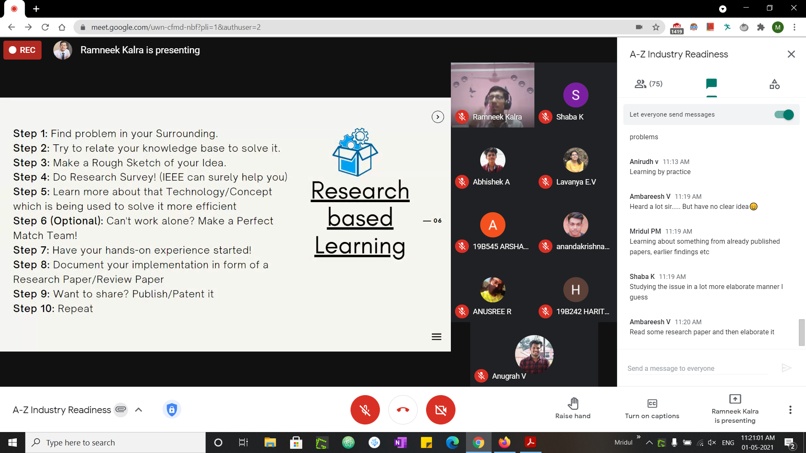

IEEE SB GCEK proudly hosted a webinar for all IEEE members on the topic ‘A to Z for Industry-Readiness’. The speaker was eminent Mr. Ramneek Kalra (IEEE Impact Creator and Project engineer at Wirpo Limited India). 
The webinar started at 11 AM. It was moderated by Shaba K. The speaker began by speaking about what the industry expects? He then moved on to project-based and research-based learning approaches. He also shared his experience in IEEE and enlightened the audience about how IEEE is beneficial for professionals. He also spoke about how to make the most out of our IEEE memberships. He then shared insights on how to build our resume. The session ended with a talk-time, where the audience cleared many doubts and concerns regarding professional career.
About 78 participants attended the session. They were energetic and interactive throughout, replying to the speaker’s questions and raising their doubts. The event was welcomed by the attendees and received very good feedback. 

