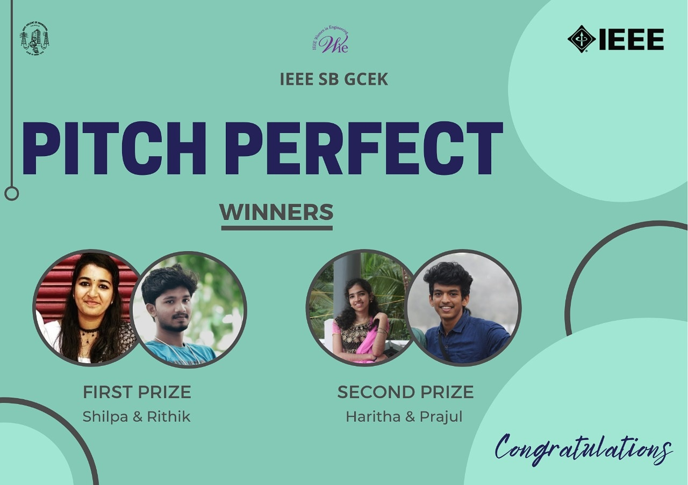

WIE Affinity Group of IEEE SB GCEK hosted an idea pitching competition titled ‘PITCH PERFECT’ on 1st November 2020 at 3pm. Participants were given 5-10 minutes to pitch an idea on the topic ‘Ways to put a check on stubble burning’. The contest was judged by Dileep M. R. and Asjad Nabeel of CSE Department. A total of 4 teams participated in this event out of which Shilpa Suresh & Rithik Rajesh bagged first position and Haritha M E & Prajul G bagged second position. The event proved to be a space for participants to display their presentation skills and share their innovative ideas.

