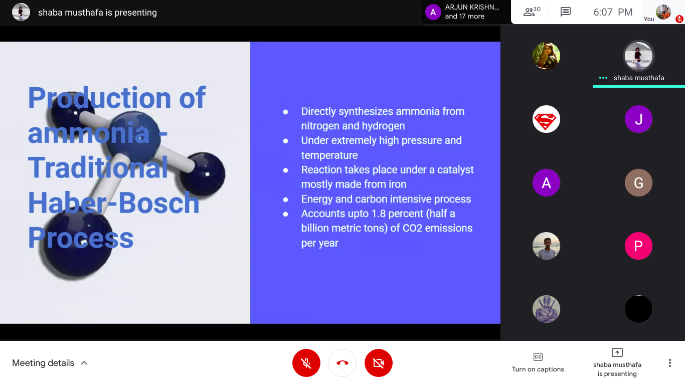

The third Spectrum Talk of IEEE SB GCEK was conducted on 3rd April 2021 at 7 PM on Google Meet.
Shaba K of S5 EEE delivered the talk on the topic ‘Will Ammonia pave way for a cleaner energy fuel? - An outlook from the shipping industry’. She covered topics including the production of Ammonia, new developments in the field, the possibility and scope of future uses of ammonia, etc. 
Over 30 members attended the talk. It ended with an interactive discussion where the audience cleared their doubts. The talk was appreciated and said to be informative.

