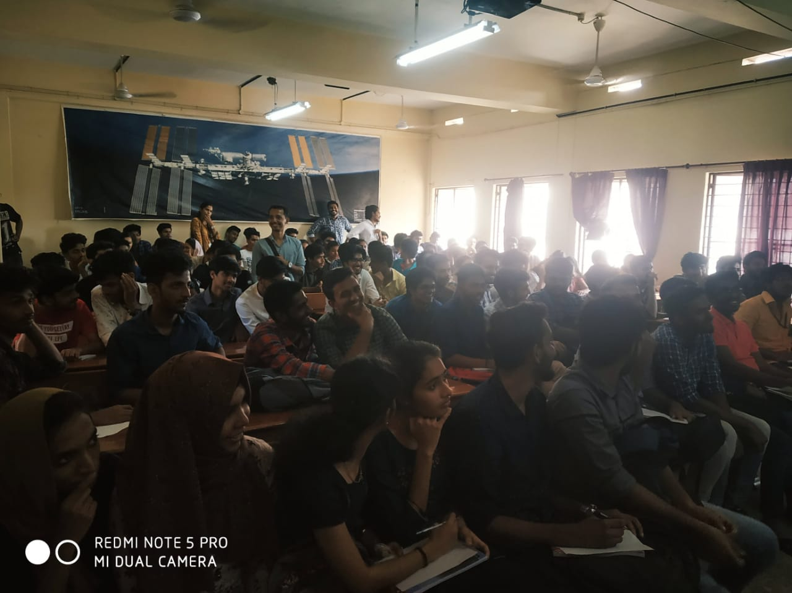

On 5th February 2020, a logo quiz was conducted under IEEE which focused on testing the ability of students on observation of logos and analysing the same. The competition was open to all students regardless the IEEE Membership, branch etc. The overall number of participants was 94(47 teams), out of which 12 teams were sorted out for the 2nd round (Final round). After a series of question and answering sessions, Mathews Roopesh & Tejas T of S2 CSE bagged the 1st prize (300/-) and Aslah & Farih from S2 EC won the 2nd prize.

