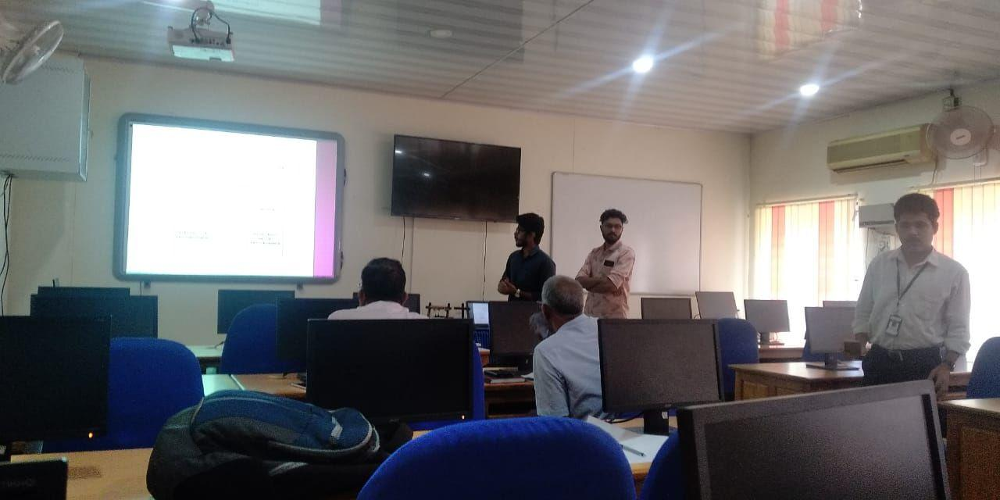

The district level of the Seminar Series competition conducted jointly by KSEB  Engineer's Association and the IEEE Power and Energy Society, Kerala Chapter was conducted in our college under the supervision of IEEE SB GCEK. The judjes of this competition were from KSEB itself. A total of three teams from different colleges competed in this. Lavanya EV of S4 CSE and Varun of S2 ECA of our college emerged victorious and were selected for the next round.

