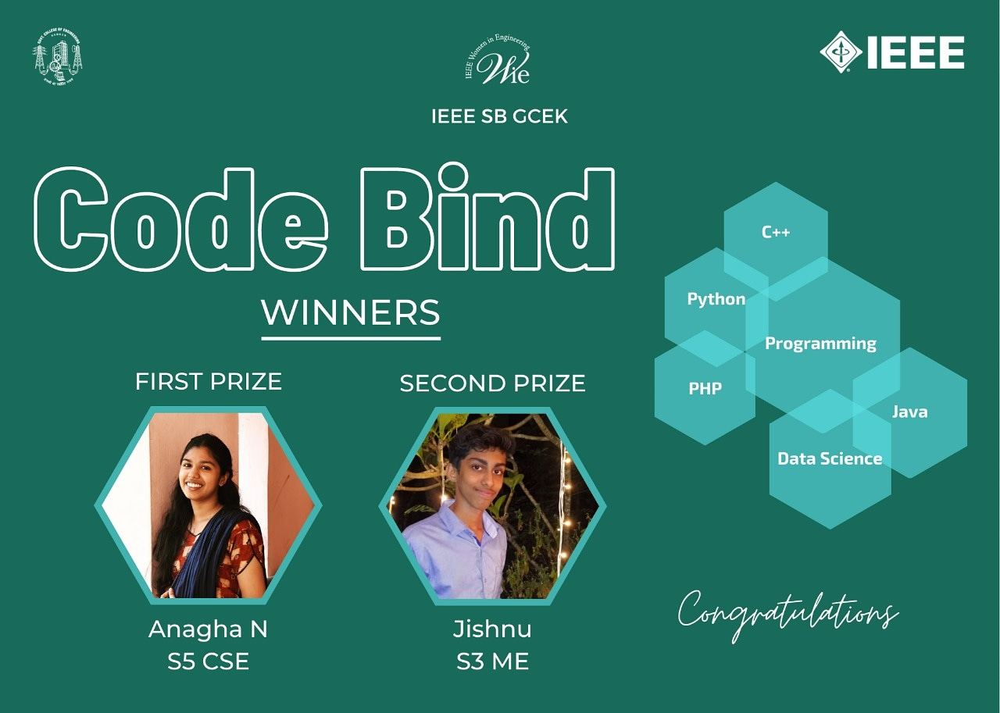

WIE Affinity Group of IEEE SB GCEK conducted a programming quiz Code Bind to brush up the coding skills and to test the programming knowledge. The program was held in HackerEarth on Nov 5th at 3pm. The time limit for the quiz was set as 20 minutes. The questions were mainly from C, C++, Python, Java etc. About 23 students participated from our college and among them the first prize was bagged by ANAGHA N of S5 CSE and second prize was bagged by JISHNU of S3 ME.
COORDINATORS : Shilpa Suresh & Reshma K R
NO. OF PARTICIPANTS : 23

