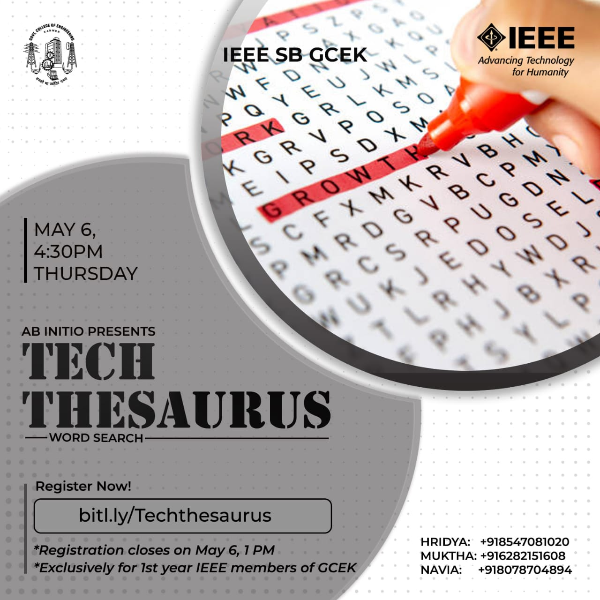
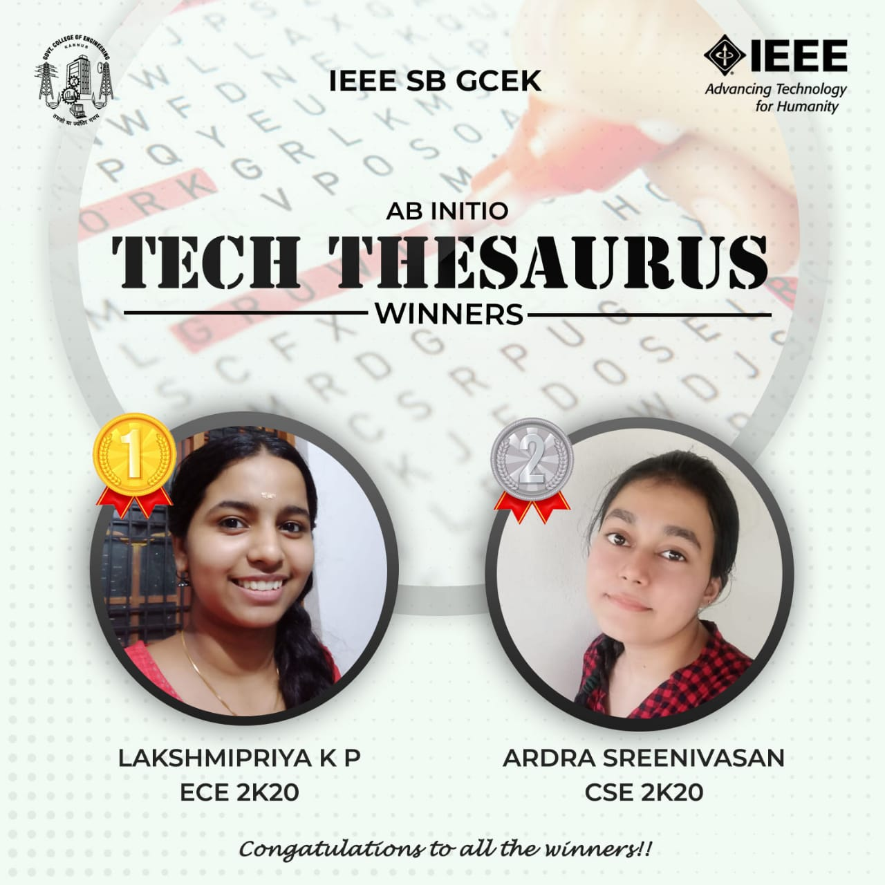

Ab Initio was a series of events conducted by the freshers of IEEE SB GCEK, exclusively for themselves. Tech Thesaurus, a word-search puzzle, was the first competition conducted under Ab Initio, on 6 May 2021. It had two rounds.

The first round was 30 minutes long word-search puzzle conducted through Whatsapp at 4.30 PM on 6 May 2021. The first five participants to find maximum answers were selected for the second round. The finalists were given a list of topics from which they had to choose two and prepare within 15 minutes. 
The second round was a live quiz through Google Meet at 8 PM.

Lakshmipriya K P of ECE 2K20  secured the first and Ardra Sreenivasan secured the second positions. The event received good feedback.

