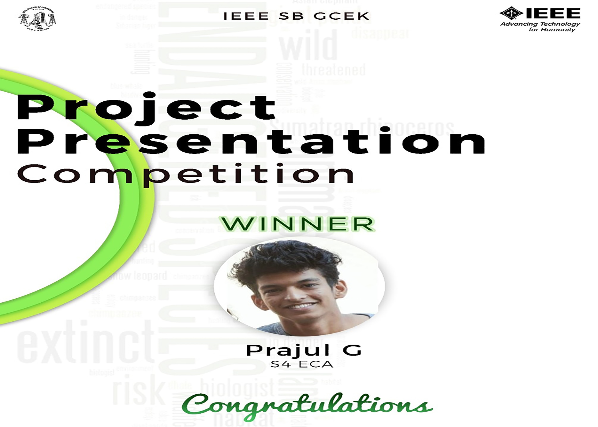

Project Presentation Competition was conducted by IEEE SB GCEK and the topic was “Role of technology in drooping the Red data book”. The competition was conducted in Google meet. Each of the participants were given 10 min for their presentation. The competition was exclusively for IEEE members of GCEK. Two vibrant students of our SB participated and presented their views on the same. Their presentations very well explained on how well technology could help in the conservation and preservation of the environment and thus help in drooping the Red data book.

