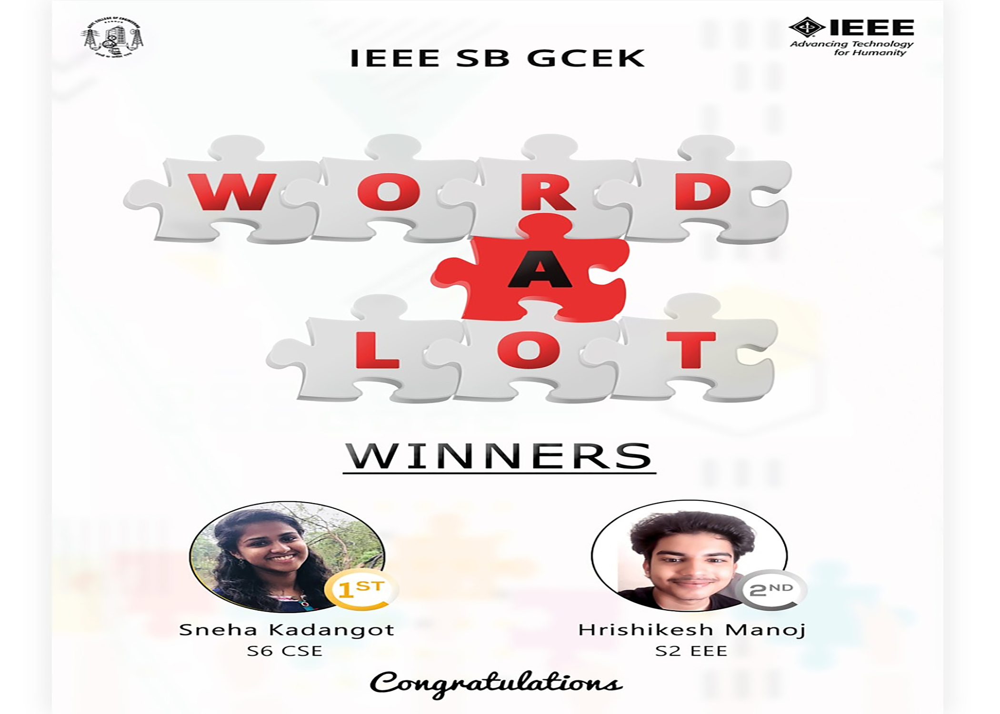

Crossword puzzles are one of the most interesting things about the newspaper for fellow puzzlers. So IEEE SB GCEK came up with the most unique crossword puzzle competition “WordALoT” to test the brains to the limit. The competition was conducted on 6th and 7th July. 2 phases for the competition was introduced, First phase included the crossword and the second phase included the quiz. This event was exclusively conducted for the IEEE members of GCEK. There was an active competition among the members and two of our fellow puzzlers bagged the prizes. The first prize was bagged by Sneha Kandangot of S6 CSE and the second prize was bagged by Hrishikesh Manoj of S2 EEE.

