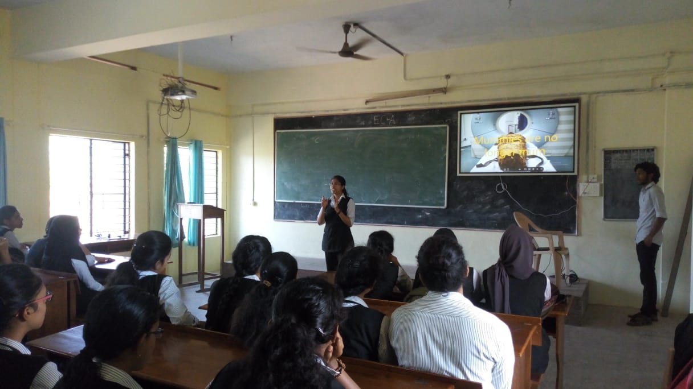

Spectrum talk was held on the topic "Mummies are no longer mum" on 7th February at 12:00 pm. The talk was delivered by Anagha N.
Anagha talked about recreating sounds of mummies that had died thousands of years ago using CT scan and X-ray technologies. There were about 35-45 curious audience. The talk was really interesting and there were many doubts regarding the topic. Anagha had very well presented it and cleared all the doubts. There was also an interactive question and answer session in which all the audience actively participated. The talk ended at around 12:20pm.

