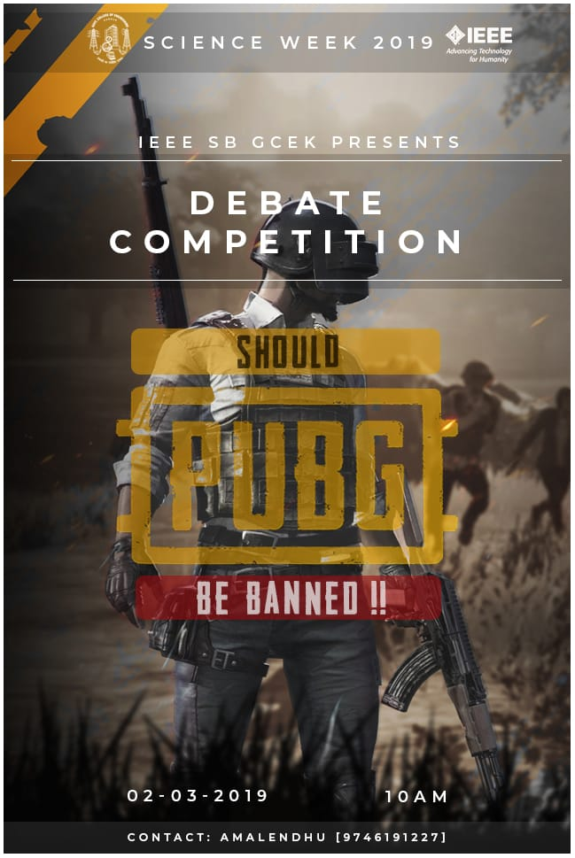

An online digital poster making competition was organised as a part of Science Week on March 7th 2019. There were 5 entries for the competition. They were asked to build up a poster for a debate competition that is to be conducted in our college on the topic "Should PUBG be banned?". After providing a time limit of 24 hours, all the participants submitted their posters. The best poster among the five was selected. Athul P of S4 CSE bagged the first prize for the following poster. 

