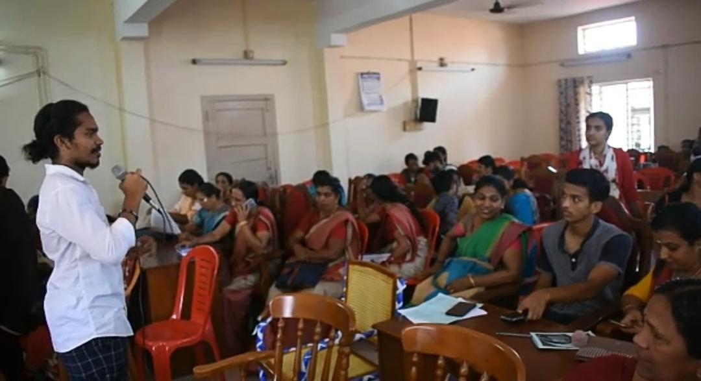

On 7th March 2020, Wise 3.0 was conducted under the WIE, Student Branch, IEEE SB GCEK. The event was a digital literacy program for kudumbasree members. More than 70 members participated. The class was taken by Amalendu of S6 CSE. The topics of discussion were online electricity bill payments, how to use Google Pay, WhatsApp and other basic mobile and online facilities. 14 students volunteered for mentoring and other works. The class was very helpful and informative for the kudumbasree members. The program ended on a good note and got a positive feedback. This was a starting session and WIE is planning to conduct more sessions like this.

