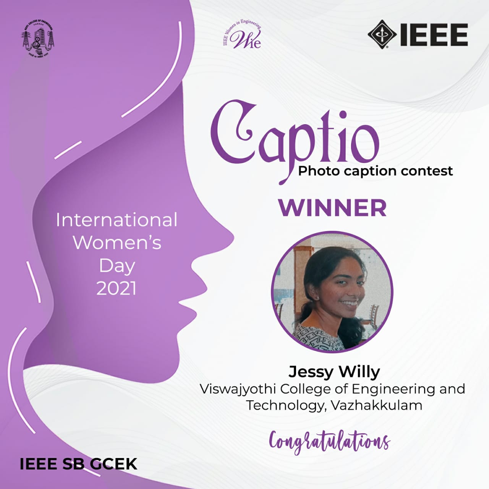

No. of Participants: 128
Coordinators: Lavanya E V, Shaba K

As a part of International Women’s Day 2021, WIE Affinity group of IEEE SB GCEK conducted ‘Captio’ - A caption writing competition. The event was open to all the IEEE Members. The event focussed on delivering the importance of women empowerment and minimizing the gender gaps prevalent. 128 participants from various colleges wrote the caption for the given picture and Jessy Willy of Viswajyothi College of Engineering and Technology, Vazhakkulam became the winner. The event was welcomed with positive feedback from participants. 

