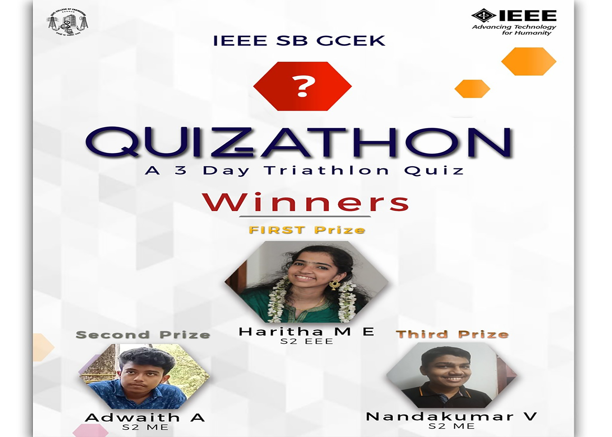

IEEE SB GCEK conducted an online quiz series "QUIZATHON" for first year students over the course of three days-May 8th, 9th, 10th. The quiz started on these days at 8pm and ended at 8:20. All three days had different topics which were already given to the students. On the first day, questions were based on current affairs, second day topic was Computer Programming and last day questions were based on Basic Electrical and Electronics. There was an active participation of students. Haritha ME (EEE), Adwaith A (ME), Nandakumar V (ME) bagged 1st, 2nd and 3rd prizes respectively.

