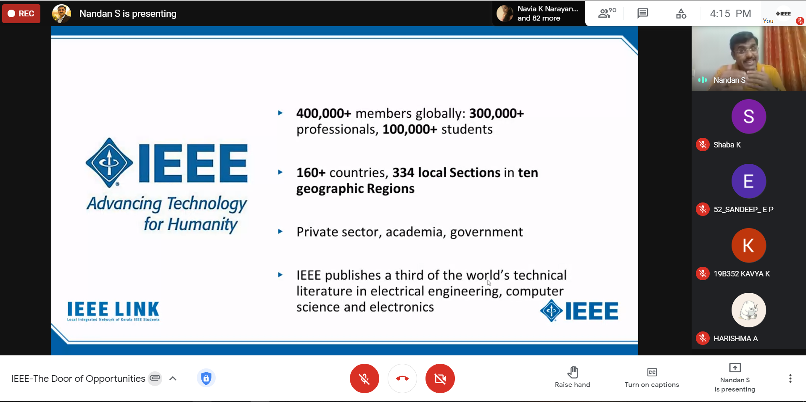

IEEE SB GCEK in collaboration with IEEE Kerala Young Professionals, hosted a webinar on ‘IEEE-The Door of opportunities’. The speaker Prof. Nandan S, Chair, IEEE Kerala Young Professionals, gave an inspiring talk for an hour and a half.
He spoke on topics like membership benefits of IEEE, the opportunities IEEE provides for students and on how to utilise IEEE membership for professional and career development. He advised the members to utilise available fundings for projects, to expand their network, and to volunteer for the community. About 90 members of our SB joined, and they all left with ignited minds.
The event got great appreciation from our members.
 

