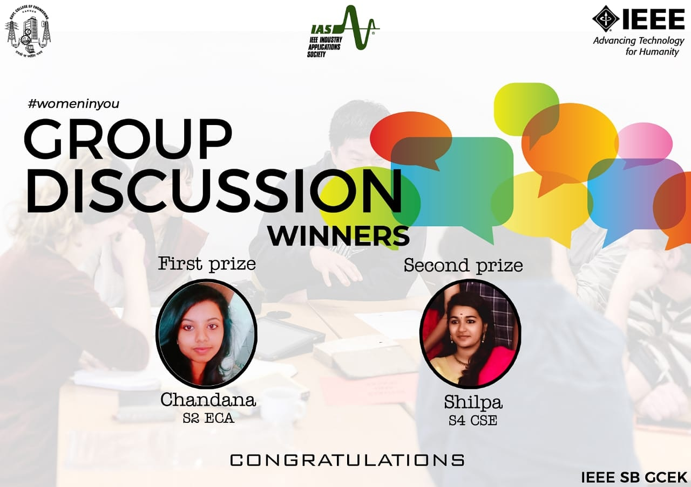

On 9th March 2020, a group discussion was conducted under IEEE Industrial Application Society which focused on testing the ability of students on observing and analysing on the topic ‘Women Empowerment’ which held as a part of International Woman’s Day. The competition was open to all students regardless the IEEE Membership, branch etc. The overall number of participants was 7, out of which 2 of them were sorted out for the 2nd round (Final round). After the 2nd round (JAM), Chandana of S2 ECE department bagged the 1st prize (200/-) and Shilpa of S4 CSE department won the 2nd prize. The event was coordinated by Akshay Sivadas.

