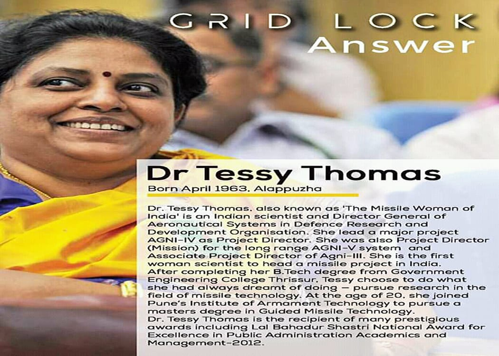
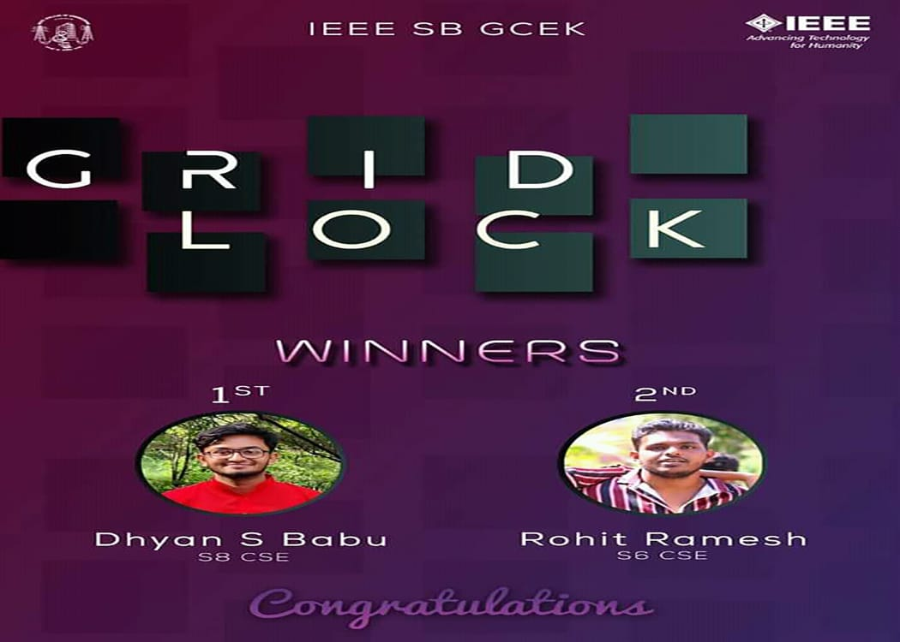

IEEE SB of GCE Kannur conducted an online event gridlock from 9th July 2020 at 7:00 pm to 12th July 2020 till 11:59 pm.

Ambareesh V Sankaran (S4-CSE),  Anugrah V(S4-CSE) ,Amal Pradeep Pothan(S4-CSE) and Rithik Rajesh(S4-CSE) were in charge of this event. The event commenced with the release of a puzzle on facebook and instagram pages of IEEE SB GCE Kannur on Monday 7:00 pm and a clue shortly after that. This continued for 4 days with each day the updated puzzle being released with a subsequent clue.

Dhyan S Babu (S8-CSE) secured first prize and Rohit Ramesh(S6-CSE) bagged second prize.

