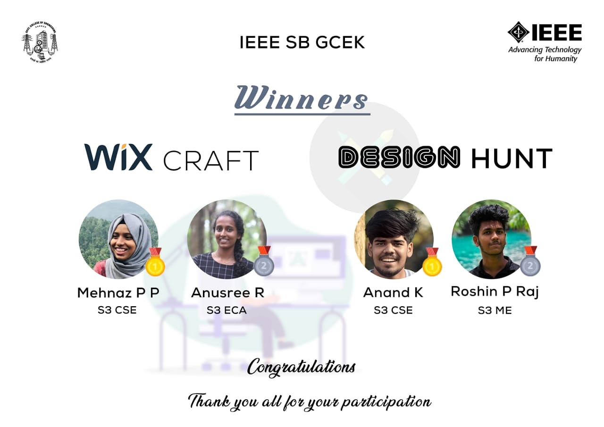

Coordinators: Jishnu PM and Jithesh Raj
IEEE SB GCEK conducted a poster designing competition ‘Design Hunt’ as a part of SB’s theme based event series. Participants were allowed to use any graphic designing platform they were comfortable with. The event was conducted on 7th December 2020 on the theme cyber security. Participants were instructed to submit their entries by 11:59 pm of 7th December. Roshin P Raj and Anand K bagged the 2nd and 1st prize respectively. The event was a huge success.

