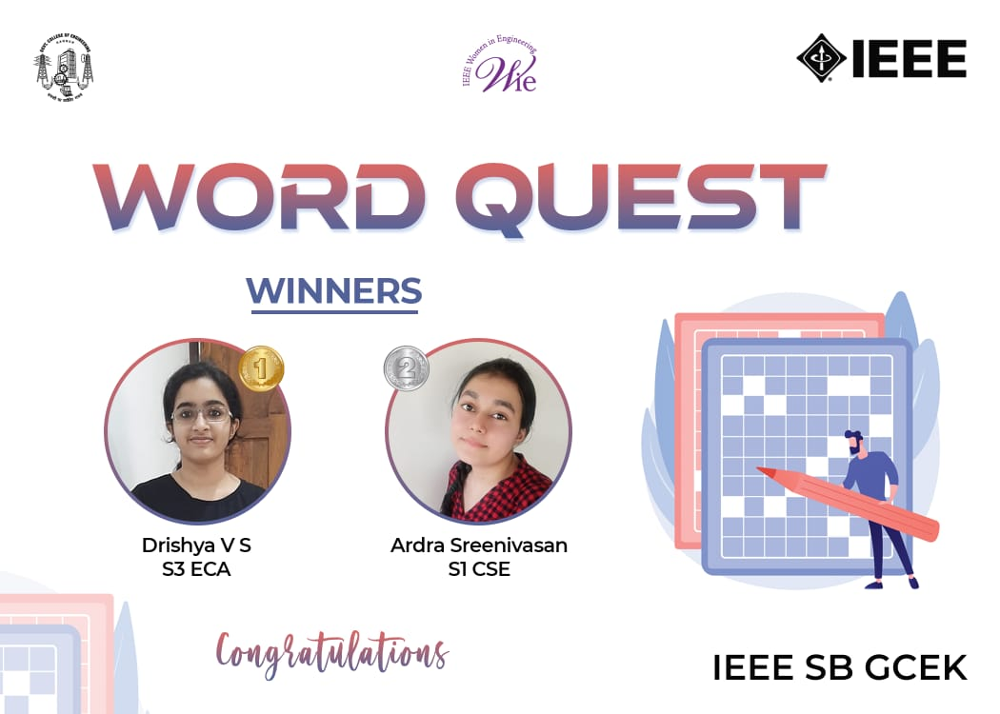

As part of WIE AG IEEE SB GCEK, ‘WORD QUEST’ a word search competition was held on 10th february 2021. Topic chosen for the competition was the names of eminent women personalities. Event gave emphasis on the importance of women in several fields of career. Competition was exclusively for IEEE members of GCEK. Around 128 participants registered, of which 84 had submitted the answers. From the submissions, Drishya V S of S3 EC A bagged the first place. Followed by Ardra Sreenivasan who bagged the second place. Event got welcoming feedback from participants in terms of its organizing and relevance. 

