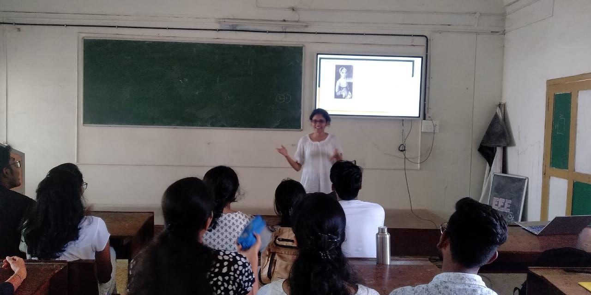

A technical talk was conducted by Vaidehi C K, IAS Secretary of IEEE SB GCEK on the topic “Women in Industrial Application” under the Women’s Week activities of IAS Chapter of IEEE SB GCEK.
Vaidehi introduced some well-established lady entrepreneurs to the audience along with their success stories. She also talked about the problems faced by working women in the past and the present challenges in front of them. The talk ended with an interactive session.  

