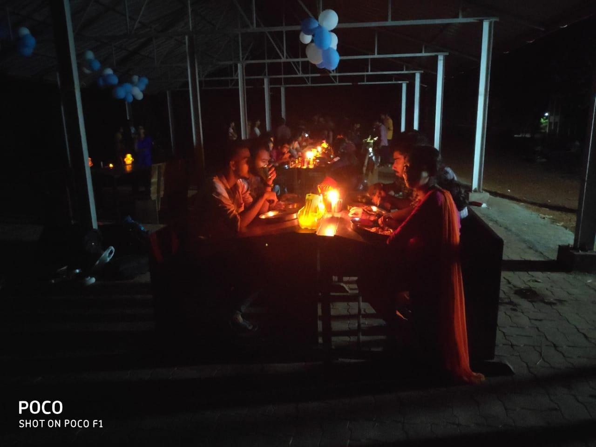

IEEE SB GCEK organized a farewell party "ENDGAME" on May 10th 2019 at the Mechanical Seminar Hall at 5 PM where the present IEEE family bid farewell to the final year IEEE members with great enthusiasm and of course nostalgia. The function began at sharp 5 PM with the welcome speech given by the IEEE chairman Abhinav S Praveen. Assistant Prof. Jayaprakash Sir presided over the function. Prof. Hemakumar Sir, who is the backbone of our IEEE SB and Prof. Rajeesh Sir, IAS and PELS counsellor wished good luck to the beloved seniors for their future. The program was even more inspirational when Nikhil Narayanan from M.Tech shared the experience that he had after joining IEEE. The inaugural session came to an end by 6 PM. P Akshaya proposed the vote of thanks.

The next session was made interesting by adding up some games and other activities. Anjali Balakrishnan from S4 ECB coordinated those programs. Every senior were given some paper pieces in which the names of final year IEEE members were written. What they have to do is to come up and share the memories that they had with that particular member. The game was really interesting and everyone enjoyed it well.

At last as usual, everyone was given a chance to share their experience all through their journey in IEEE. The experience sharing continued until 8 pm. The program ended up with a most delightful candlelight dinner.

