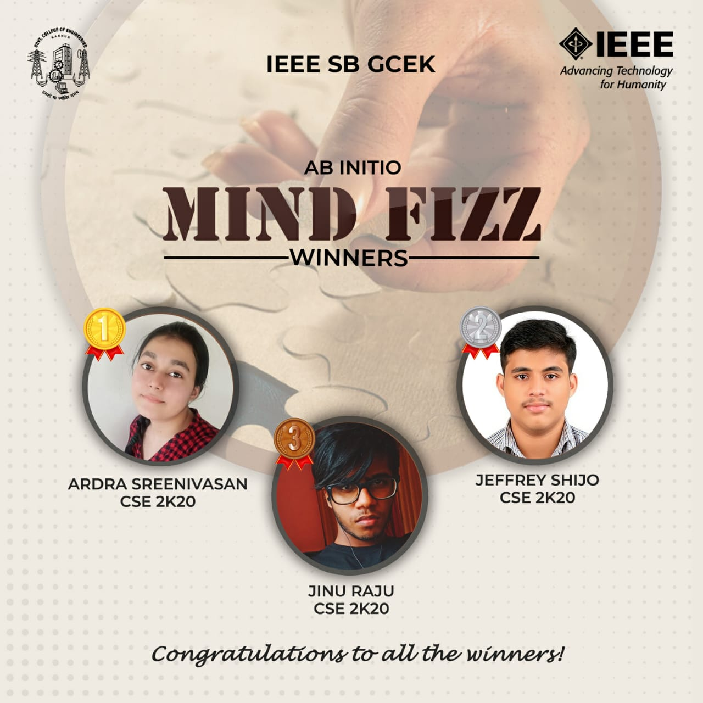

Ab Initio was a series of events conducted by the freshers of IEEE SB GCEK, exclusively for themselves.

Mind Fizz was a picture quiz conducted as the second competition conducted under Ab Initio, on 10 May 2021. It was held through Google Forms.
69 IEEE members from the first year batch participated. 
Ardra Sreenivasan of CSE 2k20 won the first prize. Jeffrey Shijo and Jinu Raju of CSE 2k20 won second and third place respectively.
The event received a great response from participants.

