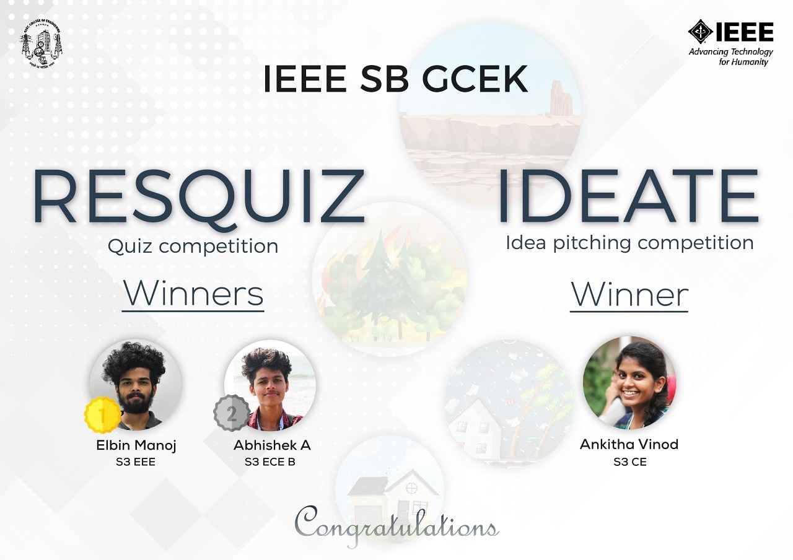

COORDINATORS: Haritha and Avani
As part of our theme based events as the 2nd event  of the theme natural disasters IEEE SB GCEK conducted an exciting quiz competition  named “REZQUIZ” on 10th and 11th of November 2020. The event was conducted as 2 rounds the 1st round was a crossword puzzle which was on 10th November at 7 pm through WhatsApp platform . the qualified participants was appearing on the 2nd  round which was a quiz round on 8th November . At the end of the event Elbin Manoj of S3 EEE  and Abhishek A OF S3 ECE bagged the 1st and 2nd positions respectively.  A lot of students participated  in this quiz which made the event a success

