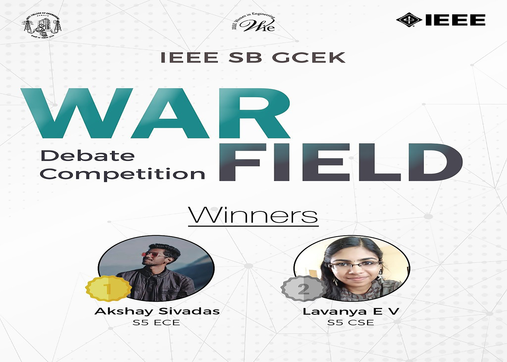

WIE Affinity Group of IEEE SB GCEK conducted a debate competition on the topic “Should humans continue living on earth or must they invest in technologies to explore and colonize other planets?”. The programme was conducted on 10th Dec 2020 at 5pm in Google Meet. A fair amount of participation was seen among the students. Among all the registered members, the first place was bagged by AKSHAY SIVADAS of S5 ECE and second place was bagged by LAVANYA EV of S5 CS

