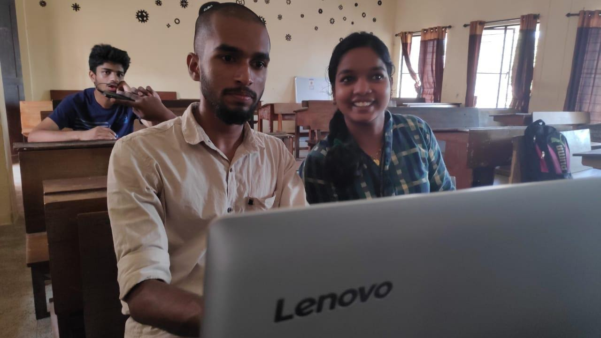

The IAS Student Chapter of IEEE SB GCEK conducted a Video Editing Workshop for the students from 8th April 2019 to 11th April 2019 between 4 PM and 5 PM at S4 ME of GCEK. The workshop was conducted by Arun Raj and Dipin M of S6 CSE and coordinated by Vishal V (S6 CSE). 8 students took part in the workshop. A refundable fee of ₹50 was collected from IEEE members and ₹100 was charged from non-IEEE members. A laptop was made compulsory for the workshop.

The workshop aimed at enhancing the students' knowledge and skills pertaining to video editing through applications.

