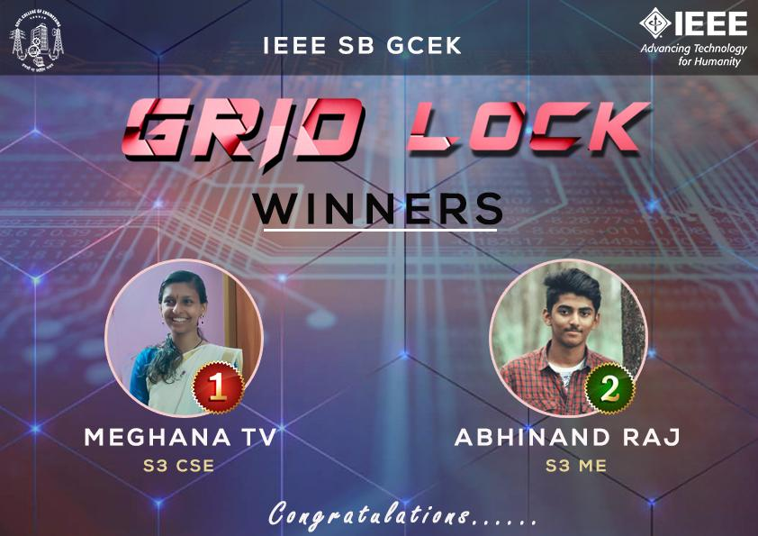

IEEE SB of GCE Kannur conducted an online event gridlock from 9th September 2019 at 7:00 pm to 11th September 2019 till 11:00 pm.

Ambareesh V Sankaran (S3-CSE), Anugrah V (S3-CSE) and Amal Pradeep Pothan (S3-CSE) were in charge of this event. The event commenced with the release of a puzzle on Facebook and Instagram pages of IEEE SB GCE Kannur on Monday 7:00 pm and a clue shortly after that. This continued for 3 days with each day the updated puzzle being released with a subsequent clue.

Meghana T V (S3-CSE) secured first prize by solving the puzzle the first day.

Abhinand Raj (S3-ME) bagged second prize by solving the puzzle the second day.

