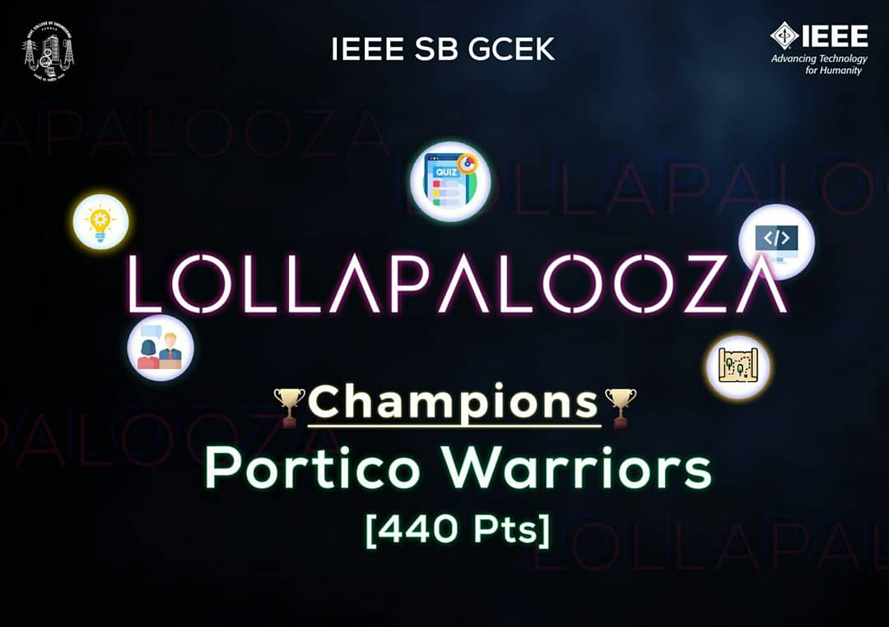
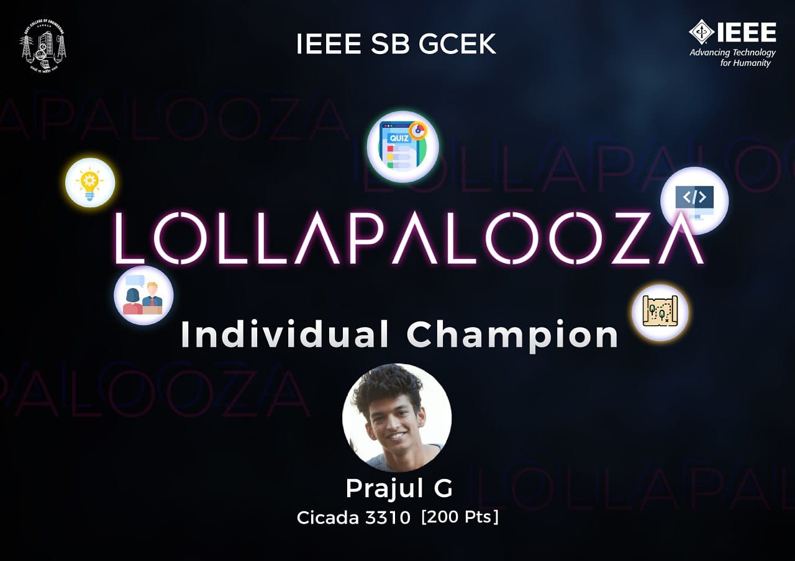

IEEE SB GCEK conducted a month long event from 12th August 2020 to 11th September 2020 known as “LOLLAPALOOZA”. All members of the Student Branch were split into 4 teams – Portico Warriors, Illuminati, Cicada 3310 and Vertraulich. Members were given full freedom to select team leaders and the team name. 8 events were conducted as a part of LOLLAPALOOZA. Winners of all events received points with participation points also given after certain criterion was filled. The events were:
1) COMDES
2) TECHNOVERSE
3) RIG IT UP
4) EL-DORADO
5) RIDDIKULUS
6) SPEQUZO
7) LOREM IPSUM
8) ENTREVISTA
Portico Warriors emerged as the overall winners and Prajul G was the Individual Champion.

