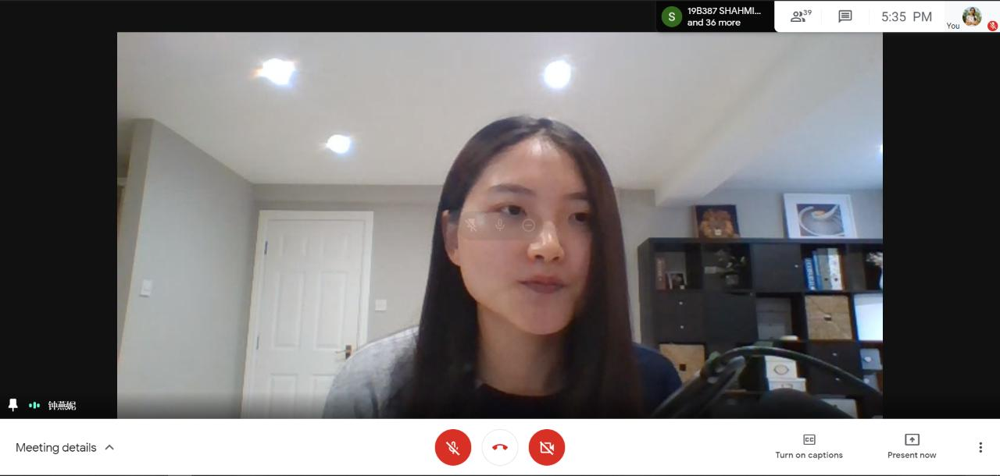

No. of Participants: 42
Coordinators: Akshay Sivadas, Anusree R

IAS, IEEE SB GCEK made the step to its first event which was a Webinar on the topic ‘Engineering thinking- R & D Role at Wind Energy Sector’. The session was handled by Dr. Yanni Zhong, Advanced Engineer,Siemens Gamesa Renewable Energy who is also the Chair of Public Relations Committee,CMD, IEEE IAS. 65 participants registered for the event. The event was held on 13 th febraury 2020 at 5 pm via google meet. 42 participants joined the session. The session went really interesting where the speaker touched up on  stories along with the speaker’s career path and how well the speaker could apply engineering thinking in studies and job. The event was opened to all ieee members. The event turned out to be extra special as we had Peter Magyar sir, IAS CMD Director also in the session.As per the information received from him this was the first virtual event at IAS. We also had 5 attendees from Germany. The session was really  informative where the speaker covered all dominant points. All the attendees were contented with the session which was worth the time. Queries raised from the attendees after the session was cleared by the speaker. The event made its end with a virtual memento presented to the speaker as a token of love from our IEEE SB GCEK family.

