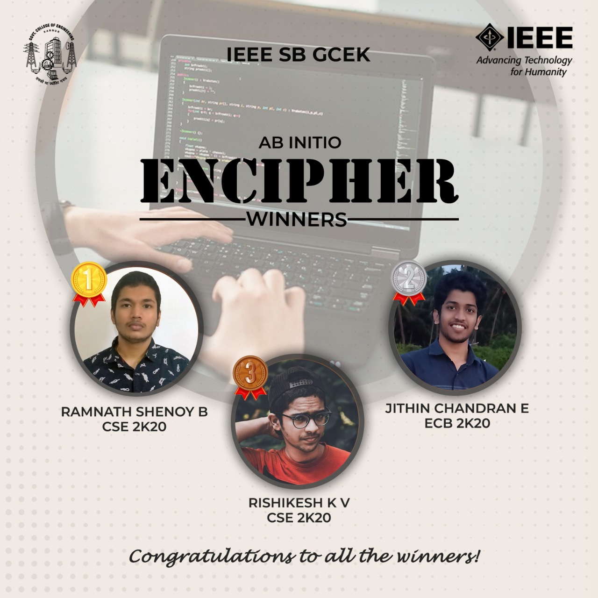

A coding competition, ENCIPHER, was conducted by IEEE SB GCEK under the banner of AB INITIO on 13  May 2021. The event was conducted through Google Forms. The participants were asked to upload the code in the form by 08:20 PM. The competition was held exclusively for first-year IEEE members of GCEK. 
Ramnath Shenoy B of CSE 2k20 won first place, Jithin Chandran E of ECB 2k20 won second place and Rishikesh K V of CSE 2k20 won third place in the competition.
The event received good feedback from the participants.

