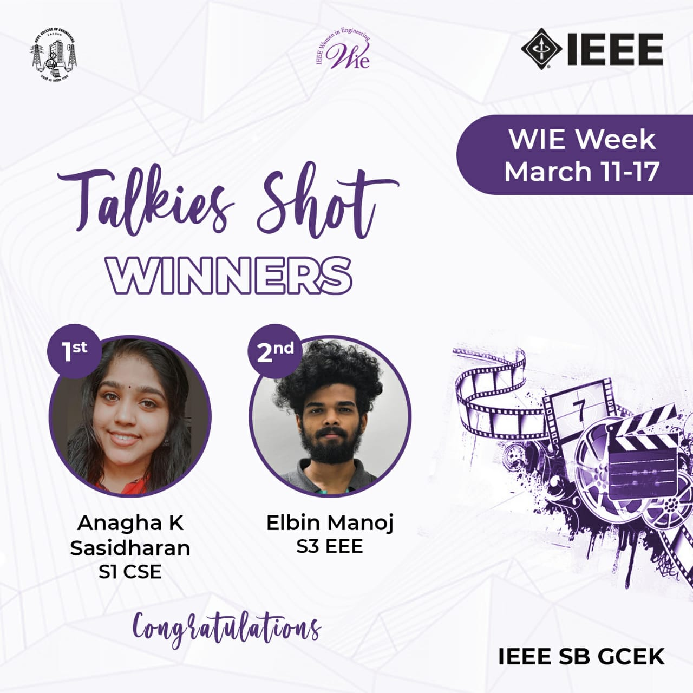

No. of Participants: 61
Coordinators  :  Anusree,Aleena,Kavya,Punya,Shivani

As a part of WIE Week, WIE Affinity group of  IEEE SB GCEK conducted ‘TALKIES SHOT’ a movie related quiz competition on 14 March 2021. The topic for the competition was to identify the female oriented movie. The event focused on highlighting the importance of women in society. Competition was conducted exclusively for the IEEE members of GCEK. The event was conducted in 2 stages. The first stage was conducted through google form and the second stage was through google meet. The top 5 players were selected for the second stage of the quiz.  Around 68 participants registered for the quiz out of which 61 attended the quiz. ANAGHA K SASIDHARAN of S1 CSE bagged the first place and ELBIN MANOJ of S3 EEE  bagged second place. The event received positive feedback from the participants in terms of its organization.

