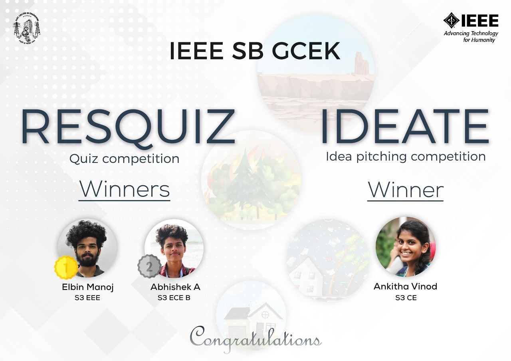

This November, IEEE SB GCEK came up with many exciting series of themes based events and one among them was IDEATE which was an idea pitching competition. The topic for the same was DISASTER MANAGEMENT AND TECHNOLOGY. The programme was conducted on 14th Nov 2020 at 3pm in Google platform. Individual as well as group participation were allowed. A good amount of participation was there and among them ANKITHA VINOD of S3 CSE was the winner.

