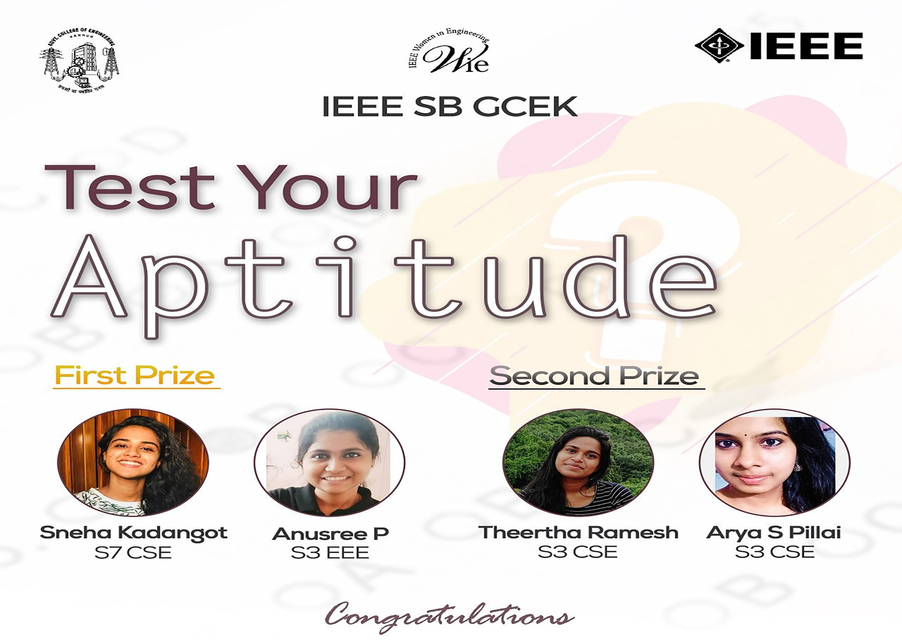

COORDINATORS: LAVANYA EV, ASWIN C, YADHU KRISHNA
NO. OF PARTICIPANTS: 60
An Aptitude Test was conducted under WIE Affinity Group of IEEE SB GCEK. The competition was conducted individually through the platform Quizziz. There were a total of 60 participants. For each question, there was options provided. The Participants were asked to choose the correct option from the choices. The total time allotted was 20 mins and the total number of questions was 15. The questions were diverse and tricky.
Sneha Kadangot S7 CSE and Anusree P S3 EEE of S5 CSE were the ones who secured the first position. Theertha Ramesh S3 CSE and Arya S Pillai S3 CSE were the ones who secured second position.  All the participants were really thrilled to answer the aptitude questions. Overall the event was a great success.

