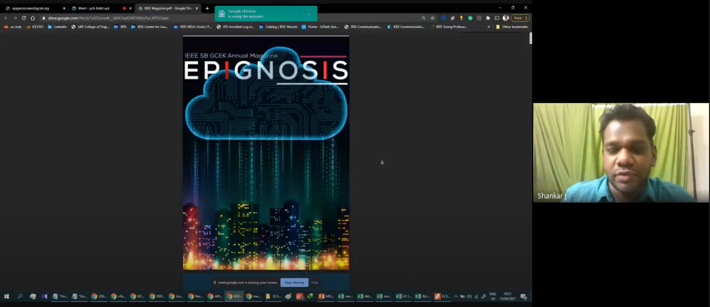
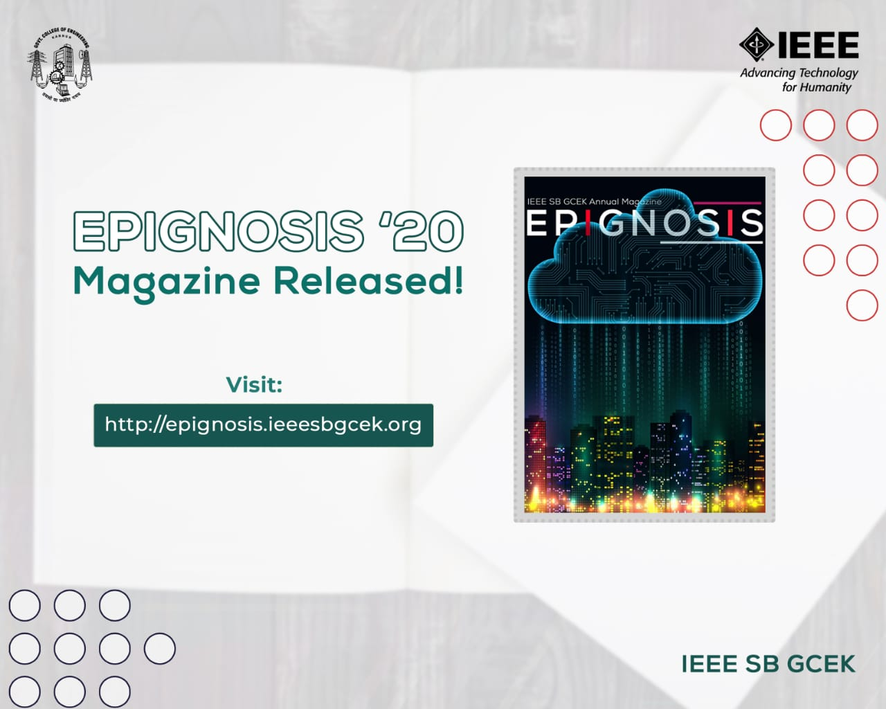

IEEE SB GCEK released its annual magazine of 2020, ‘Epignosis’, on 15th April 2021. The event was hosted on Google Meet. The chief guest was Prof. Shankar Jayaraj (Chair, Students Activities Committee, IEEE Kerala Section). Above 90 members of our SB attended.
The function began at 7 PM with a welcome speech by Haritha M E, followed by pledging of the Code of Ethics by Mridul P M. The presidential address was delivered by Dr. Jayaprakash (Staff Advisor, IAS SBC GCEK). 
The chief guest inaugurated the programme and released the annual magazine. He appreciated the effort of students behind the magazine and congratulated the SB for the noteworthy work.
The event culminated by 8 PM with a vote of thanks by Shilpa Rajeev. Lavanya E V was the anchor for the event.
The magazine received great appreciation from the student community and faculties of our college.

