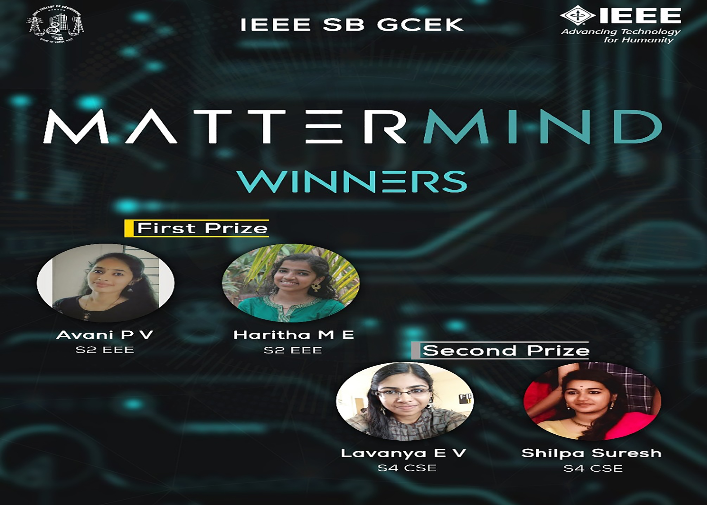

IEEE SB GCEK conducted an online circuit designing competition “Mattermind” from June15-June 21. Competition was conducted in three stages. The first round consisted of a quiz on Basic Electronics and only the selected people were allowed to participate in the next stage which was a circuit debugging competition on a given circuit. Then, a selected few were permitted to third stage in which participants were asked to design a circuit using any software. 24 people participated in this competition. It is allowed to participate either in a team of two or as individual. Haritha M.E and Avani P.V of S2 EEE bagged first prize. Lavanya E V and Shilpa Suresh of S4 CSE secured the second position. 

