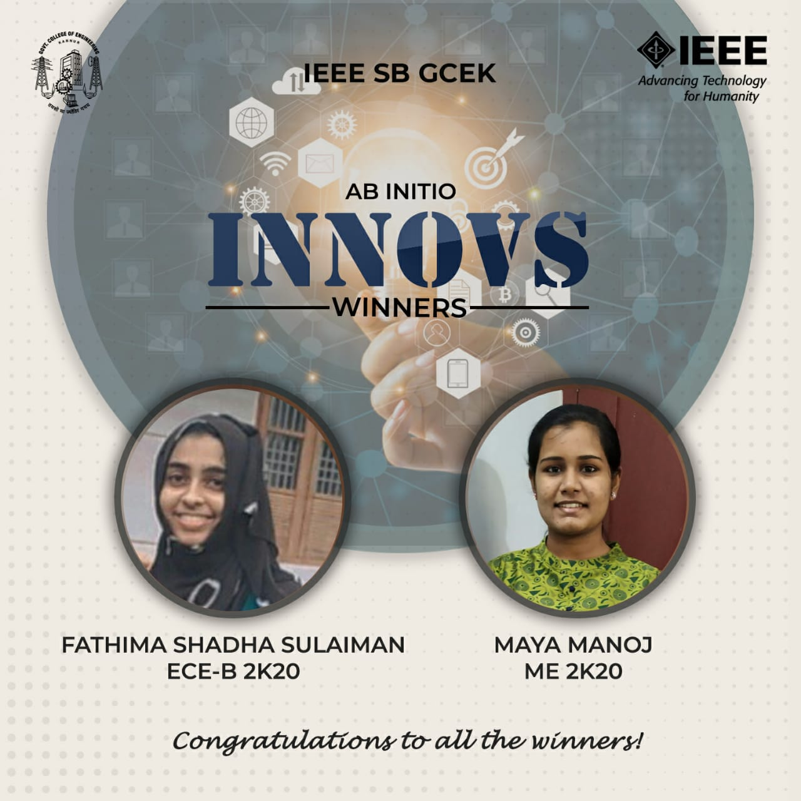

Ab Initio was a series of events conducted by the freshers of IEEE SB GCEK, exclusively for themselves. Innovus, an idea-pitching competition, was the third competition conducted under Ab Initio. 

The problem statements were released on  14 May 2021. They were-  
1) Innovation to help improve women's personal hygiene and safety in public.
2) Churn out an e-solution to tone down the damages caused by the recurring flooding situation in Kerala.
3) A way to better and faster emergency care during accidents and vehicle impact.
4) Access to remote education during the pandemic.

Participants were asked to submit their ideas through a google form. Interesting and innovative ideas were proposed by the participants. 
Fathima Shadha Sulaiman of ECB 2k20 won first place, while Maya Manoj of ME 2k20 won second place in the competition.

