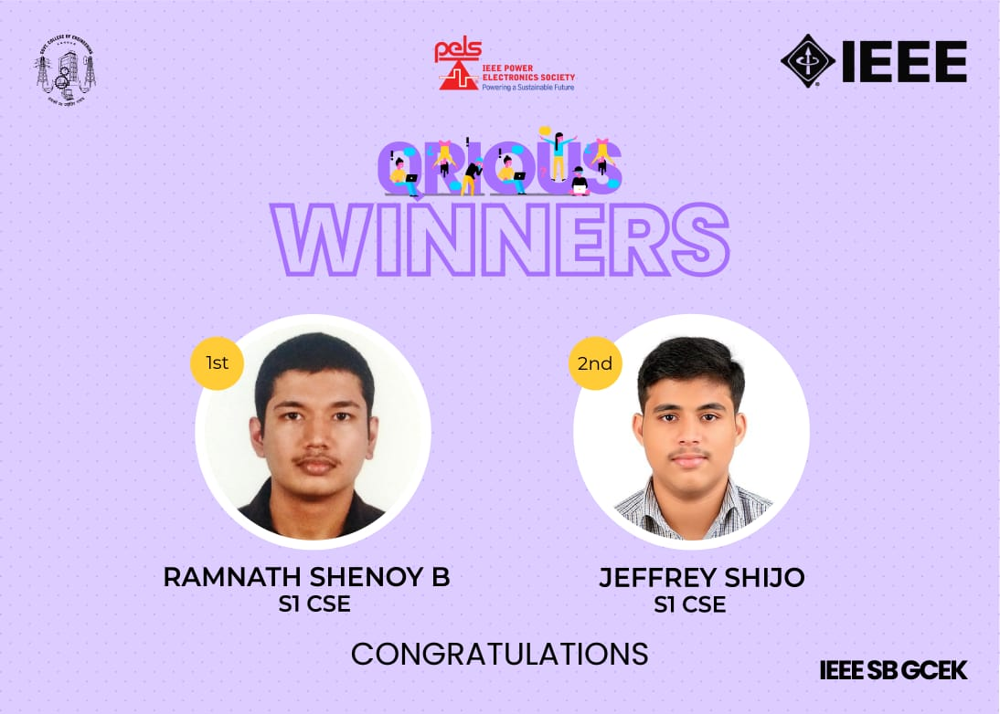

No. of Participants: 68
Coordinators: Avani P V and Jijina C

Power Electronics Society of IEEE SB GCEK conducted a quiz, ‘Q’RIOUS on 17th February, 2021. The questions of the quiz were based on basic electrical and electronics. The competition was conducted exclusively for First year IEEE members of GCEK. 68 students registered and 42 of them submitted the answer. Ramnath Shenoy B of S1 CSE bagged first prize and Jeffrey Shijo of S1 CSE bagged the second prize. 

