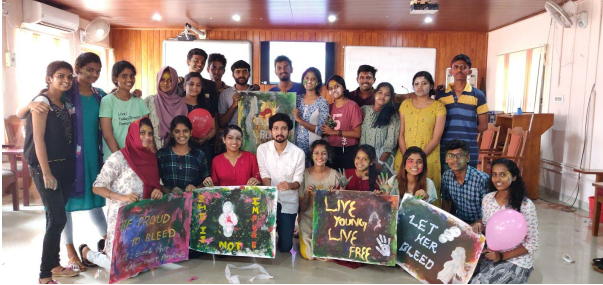

The WIE affinity group of IEEE SB GCEK had conducted RHEA 3.0 on 17th November 2019 from 10 am to 1 pm. The fundamental aim of RHEA 3.0 is to provide awareness about menstrual hygiene to girls and to break the taboo over periods. Rhea 3.0 was an open event for girls as well as boys to make them aware of the menstrual cycle. A total of 25 students attended the event including the volunteers. The event started with an official inauguration ceremony on 10 am, with Sreelakshmi M Rajeev ( Vice-chair IEEE PELD )anchoring the event and Anjali Balakrishnan (Secretary - WIE affinity group) delivered the welcome speech. Anjana Ramesh (Chairman - WIE affinity group) delivered the IEEE Code of Ethics. Dr Vandana Sreedharan officially inaugurated the programme and Vaidehi C K delivered the vote of thanks for the event.

After the official inauguration, Sonu J S (CEO of Starting Trouble) started the talk. He provided awareness about menstrual hygiene and an ideation session for Sanitary napkins and Menstrual cup. The event ended by the students creating posters in their groups based on the event's Moto "Let's break the taboo over periods". Overall the event was a grant success. At last Sonu J S thanked the volunteers for inviting him for the wonderful event.

