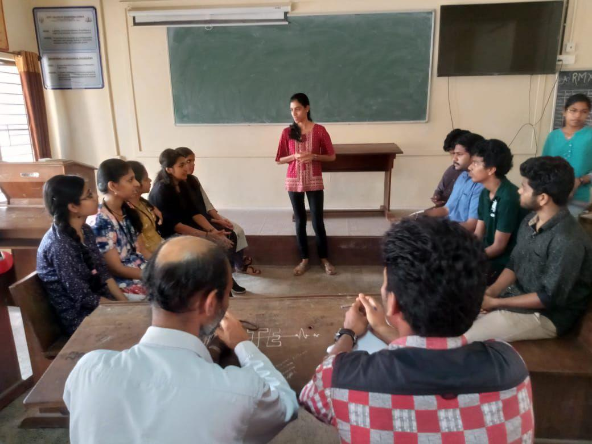

On 19th February 2020, a Debate competition was conducted under IEEE SB GCEK. The topic for the debate was already given to the participants with the release of the poster; it was – “Does Google make us Lazy?” The competition was open to all students regardless of the IEEE Membership, branch etc. A total of 9 students participated. The judges were Thahir Sir and Amal of S8 ME. The students were divided into two teams on the spot and the ‘for’ and ‘against the notion’ was decided then. An initial introduction of 5 minutes by each student was followed by a debating session of 15 minutes after which the teams were asked to present the concluding statements. There was active and energetic participation from each and every student who debated. Lavanya EV of S4 CSE bagged the position of ‘Best Orator’ in the Competition. The program ended on a good note.

