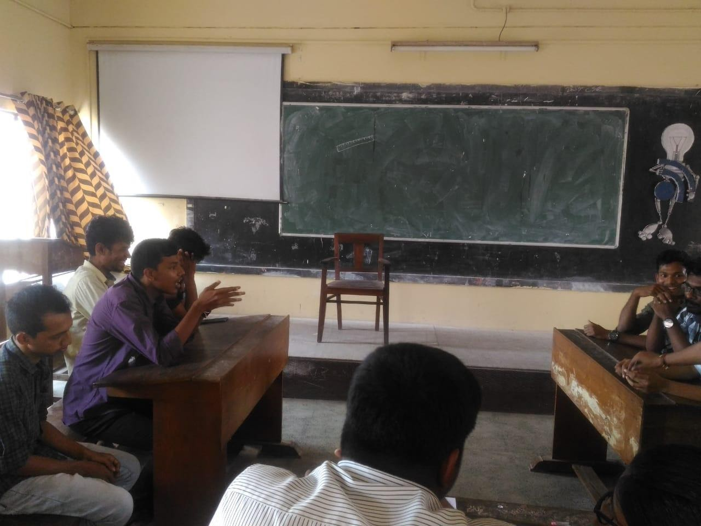

A debate competition was conducted by IEEE SB GCEK as a part of WIE week on March 19th 2019. The students debated the topic "Technology changes the lifestyle and living spaces". The participants were divided into two groups arguing for and against the topic. The debating room was heated up with discussions and arguments. It was a 20 minutes lively discussion in which the participants gave their opinions and asked questions. The best orator and runners up were selected by the judging panel.

Abhijith Dasan of S2 ME bagged the best orator prize. Vismaya Sunil of S4 EC B and Amal M Prasanth of S6 ME were the runners up.

**Event Coordinator**: Tejasree M V (S2 EC A)