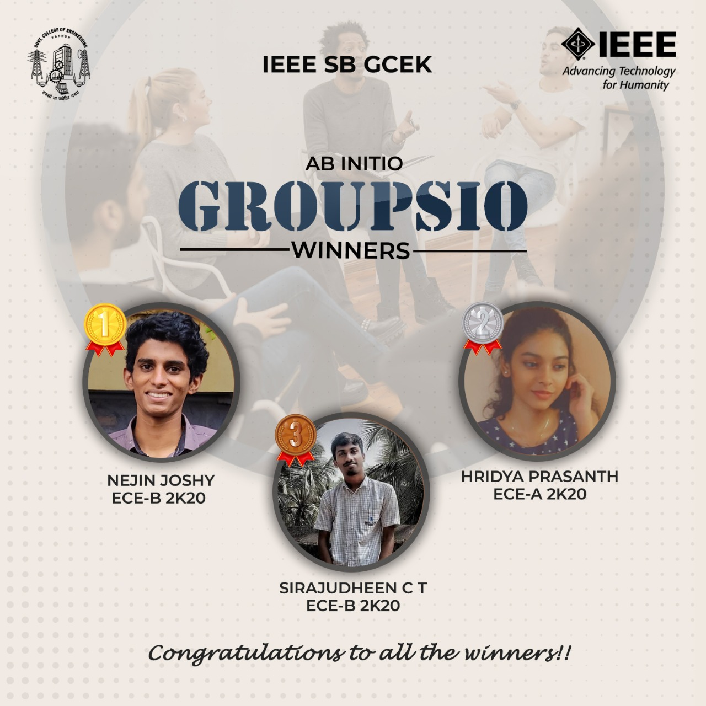

Ab Initio was a series of events conducted by the freshers of IEEE SB GCEK, exclusively for themselves. The fifth event under this was ‘Groupsio’, a group discussion. The topics given for the discussion were ‘Is internet curbing creativity?’ and ‘Impact of Covid-19 on education sector’. It had 8 participants and was conducted through Google Meet. 

All participants put forward their views and presented very well.
The first prize was won by Nejin Joshy of 2k20 ECE B, the second prize by Hridya Prasanth of 2k20 ECE A and the third prize by Sirajudheen C T of 2k20 ECE B.

