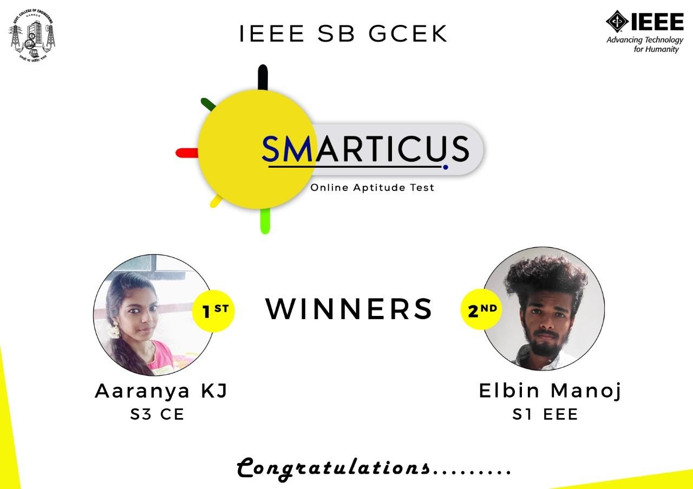

IEEE SB of GCE Kannur conducted an Online aptitude test on 19th September 2019 at from 8:00 pm to 8:20 pm. 102 students participated in the event.

Pratheek Nambiar (S3-ECB) and Akshaya Ganesh (S3-ECB) took charge as coordinators. The event commenced with sharing the link to the students at 8:00 PM via online media. Contestants were asked to answer 20 multiple-choice questions.

Aaranya KJ(S3 Civil) secured the first position and Elbin Manoj (S1 EEE) bagged the second position.

