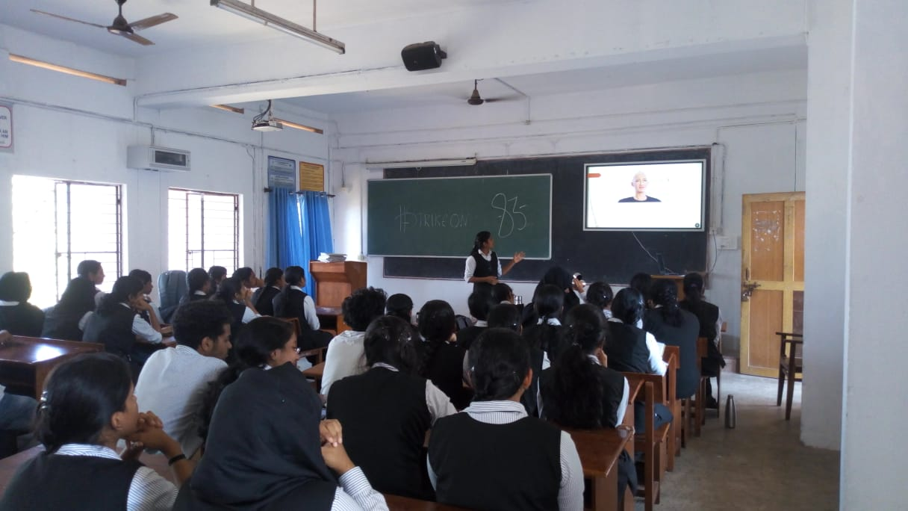

The third spectrum talk was held on a very relevant  topic "Protecting humanity from superhuman machines" on 20th February 2020 at 12:30pm. The talk was given by Ankitha Vinod of S2 civil. She spoke about AI research making, its long term goal of making superhuman intelligent machines and its consequences. She said that AI requires machines to pursue a fixed objective specified by humans, so that we can anticipate or prevent the harms that are caused by machines pursuing an incorrect objective when it operates on global scale with superhuman capabilities. The talk caught the attention of the audience within seconds and there was an active participation of students gathered there. There were a lot of doubts and opinions from the audience and Ankitha handled it very well.

