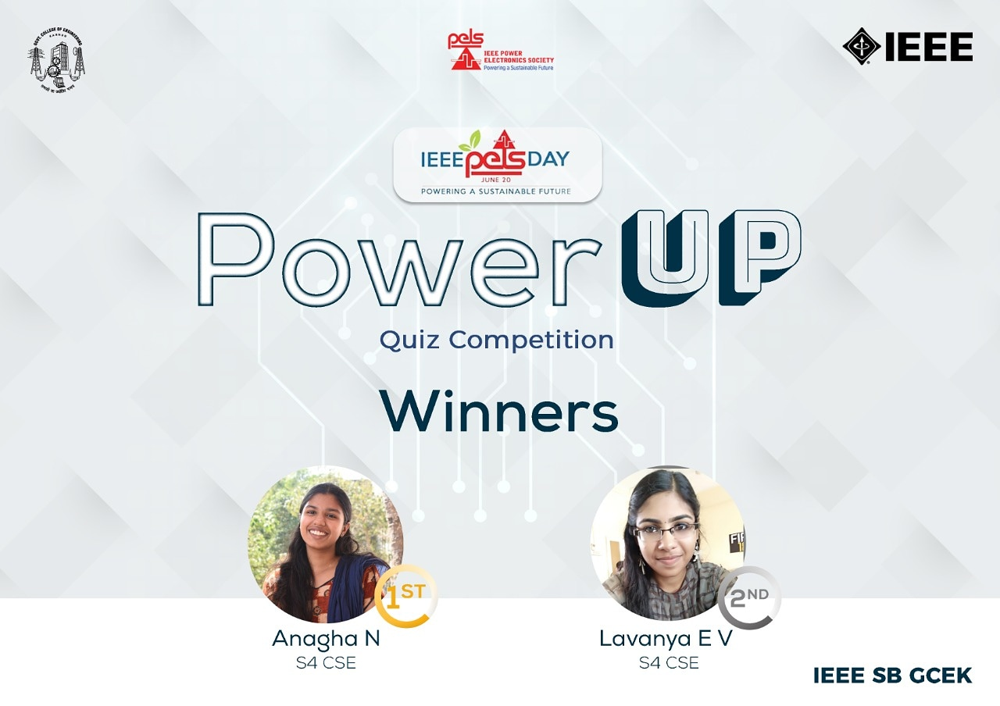

June 20th is celebrated as world PELS day. As part of PELS day celebration, Power Electronic Society (PELS) of IEEE SB GCEK conducted an electronic quiz  “Power Up” on 20th June 2020 . The quiz started at 8 PM and ended on 8:20PM. The event was conducted through the ‘Quizizz’ application. The quiz contained a total of 20 questions covering the topics - basic electronics and power electronics. A total of 18 students participated in the event. The quiz was conducted exclusively for IEEE members of GCEK.

Anagha N and Lavanya EV of S4 CSE bagged the first and second position respectively.  

