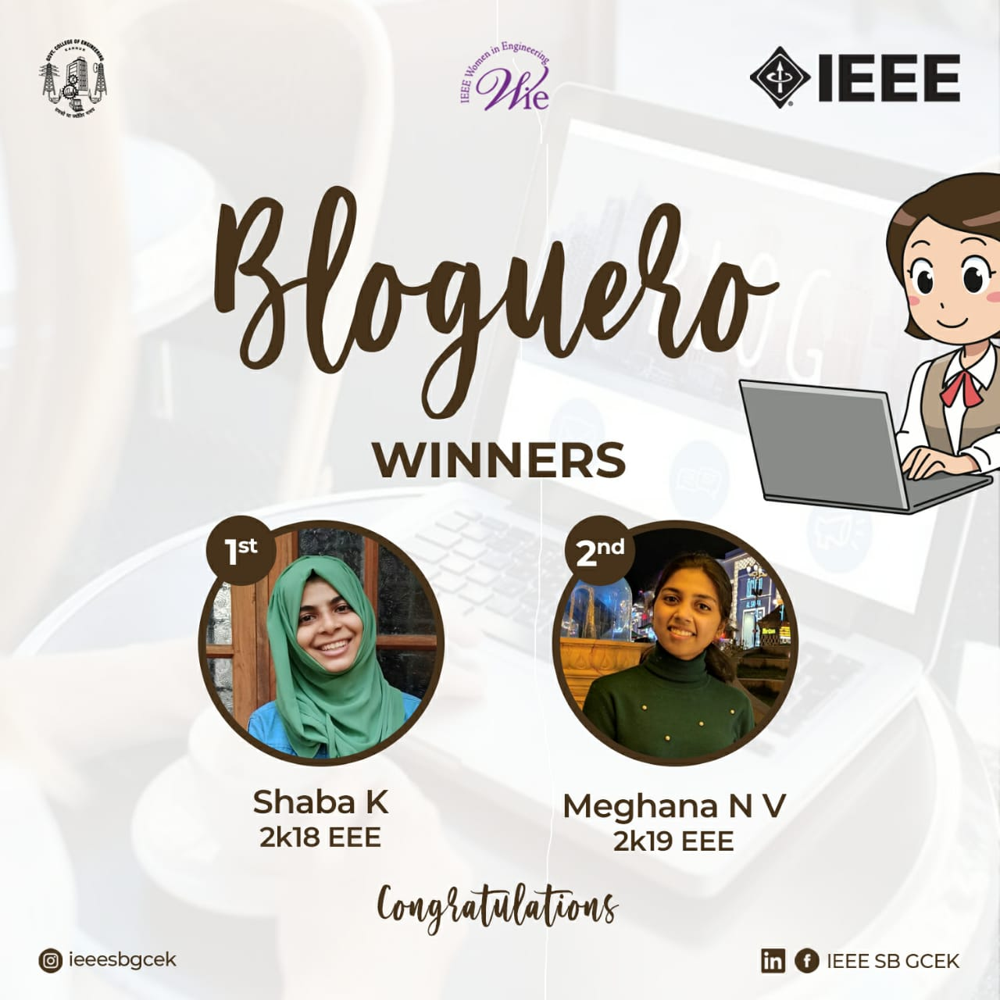

WIE AG IEEE SB GCEK conducted a Blogging Contest, BLOGUERO, from 23rd May 2021 to  30th May 2021. The topic of the contest was “Technology That Made You Feel Astonished”. The event was conducted through Google forms. The participants were asked to upload the pdf file in the form before 11.59 PM. The competition was held exclusively for IEEE members of GCEK. Shaba K of 2k18 EEE won the first place and second place was won by Meghana N V of 2k19 EEE.

        