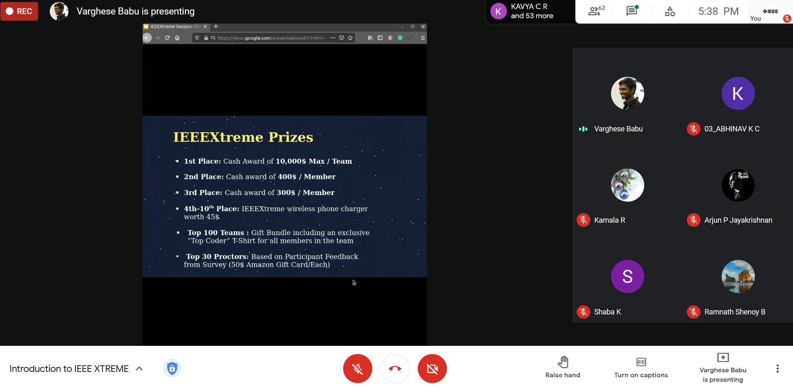

IEEE SB GCEK conducted a webinar on ‘Introduction to IEEEXtreme’  with an aim to introduce our members to the IEEEXtreme competition and to make them aware of its significance. The speaker was Mr Varghese Babu, IEEEXtreme 15.0 Section Lead. About 67 members attended the session. It lasted for about an hour and a half.
The speaker and audience interacted well. The session was interesting and informative. The audience left inspired to prepare and participate in the event.

        