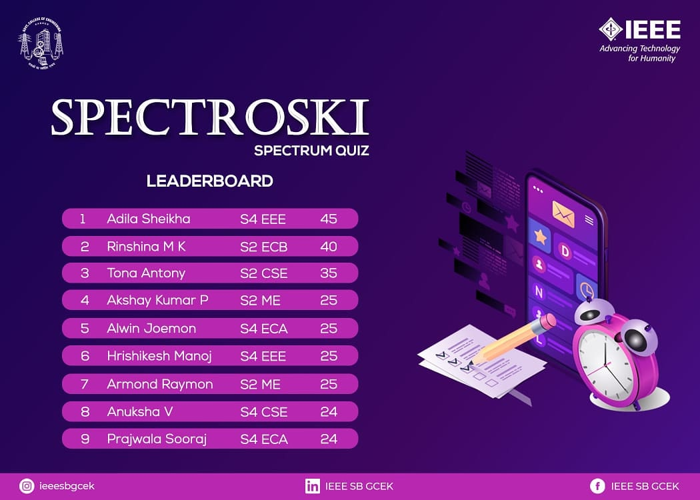

Spectroski is an eight-month-long quiz series conducted by IEEE SB GCEK for its members. Its aim is to encourage our members to read the IEEE Spectrum Magazine and also to build general knowledge. The questions are from the IEEE Spectrum Magazine and also general knowledge. Scores of participants will be accumulated over the eight quizzes to declare the winners. The quiz was conducted through google forms and had 87 participants. A leaderboard of the top 9 participants was released.

        