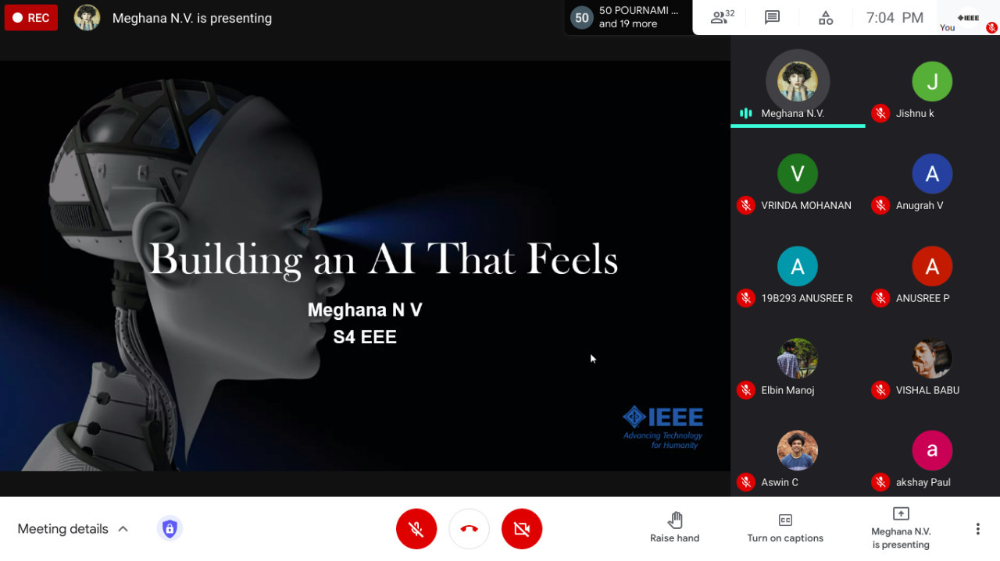

IEEE SB GCEK conducts talks exclusively for its members, based on 'IEEE Spectrum', a monthly magazine published by IEEE. This is to introduce our members to new technologies and inventions. The fourth Spectrum Talk was conducted on 31 May 2021 at 7 PM. 
Meghana N V of EEE 2k19 delivered a talk on the topic ‘Building an AI that feels’. She spoke about how an AI system that can understand human emotions can be a breakthrough in technology. She talked about the current research and developments in this area and discussed the pros and cons of such a system.
The talk lasted for about 20 minutes. There were 39 members among the audience. The audience was actively involved in the discussion with doubts and comments. 
The talk received excellent feedback from the listeners.

        